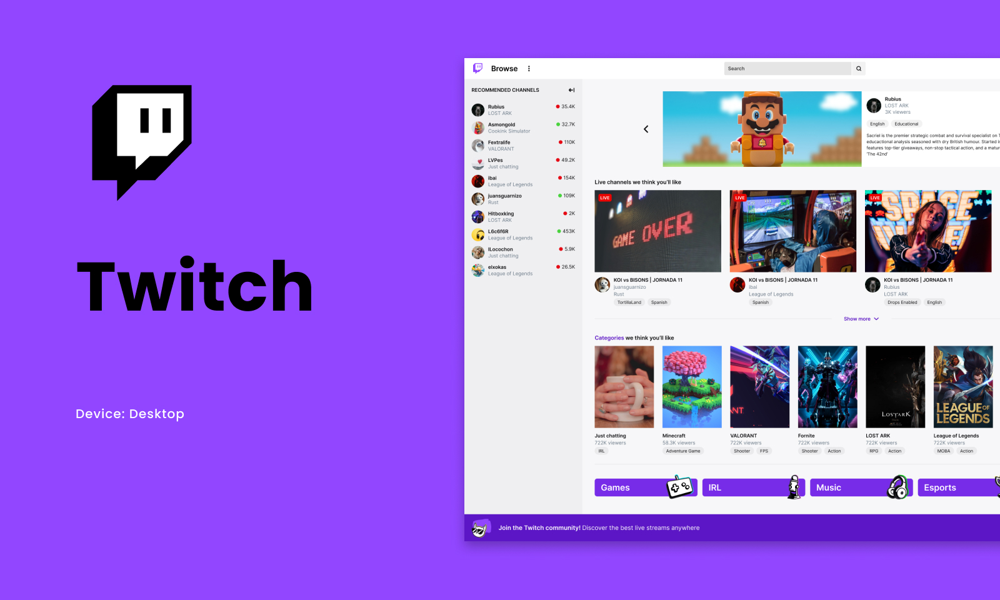

# Twitch

<p align="center">
  
</p>

```js
import FullStackDeveloper from 'Hernanarica';

class Me {
  name     = 'Hernán Arica';
  title    = 'Desarrollador Full Stack';
  company  = 'Kickads';
  location = 'Ciudad de Buenos Aires, Argentina';
}

class Skills {
  languages  = ['css', 'html'];
}
```

⭐️ From [HernanArica](https://github.com/Hernanarica)